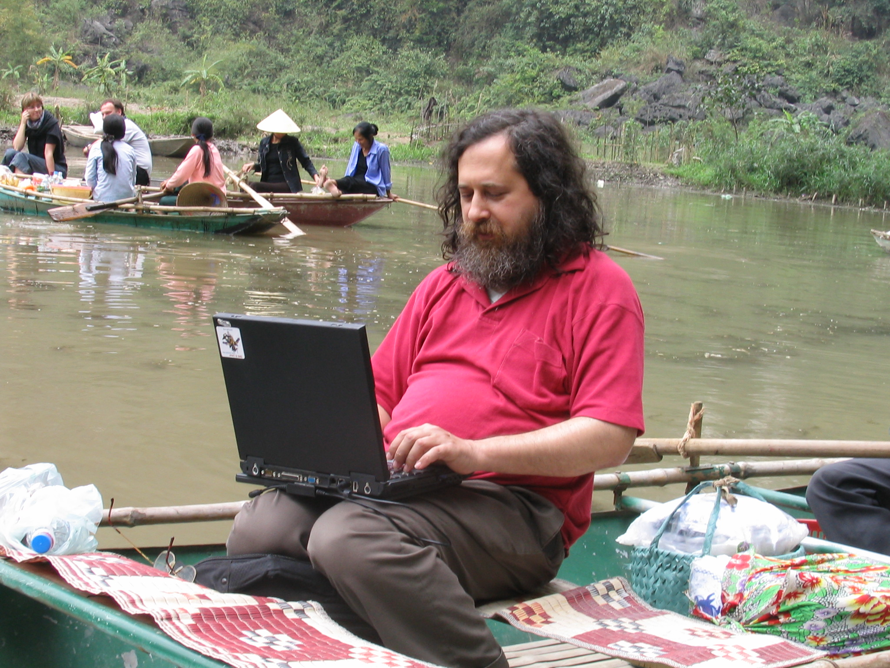
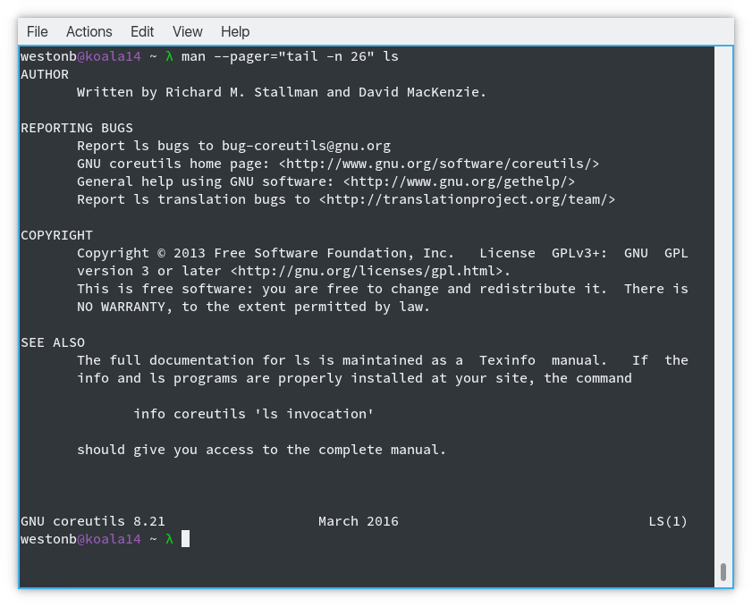

## The GNU Project

A presentation by Weston Belk

---

## What is GNU?

* An operating system
	- A collection of userland software
	- GNU's Not Unix
	- Coreutils
	- Text editors, games, and more!
* Ubuntu, Fedora, and other Linux distributions use GNU software
* Free software movement

---

## Richard Stallman

* Creator of the GNU Project
* MIT Artifical Intelligence Lab (1970s)
	- Learned to love open source

<figure>
	
	<figcaption class="imgcaption"><a href="https://stallman.org/photos/vietnam/tamcoc/img_0554.jpg">Photo</a> by <a href="https://stallman.org">Richard Stallman</a> is licensed under <a href="https://creativecommons.org/licenses/by-nd/3.0/">CC BY-ND 3.0</a></figcaption>
</figure>

---

## Why was GNU created?

* Richard Stallman watched a community he loved crumble
* He was fed up with proprietary software
* Wanted to recreate that community that he loved
	- Decided to write a free operating system
	- Free as in freedom

---

## Philosophy

* What is free?
	- Free as in beer ($$$$)
	- Free as in freedom
	- Freedom does not imply free as in price
	- Freedom means:
		- Free to use however
		- Whenever
		- On whatever
		- Source code is available
		- You can do *what you want to do*

---

## How

* The problem with other free software licenses
	- Wrong goals
	- Too permissive
* The solution: Copyleft!
	- Not the opposite of copyright
	- Uses copyright as a means for keeping the software free
	- Permissions to do anything except for adding restrictions
	- Infectious: Modified versions must also be free

---

## Some GNU Licenses

* GNU General Public License (GPL)
	- Most well-known license
	- Can cause licensing issues in large projects
	- Enterprise tends to avoid

* Lesser GNU General Public License (LGPL)
	- Allows proprietary software to link to the software

---

## Impact on Computing

* Helped lead to the popularity GNU/Linux systems
	- When you think Linux you think GNU Coreutils
	- GNU/Linux is dominant in the server world
* Some of the best software
	- Web servers
	- Source control
	- Compilers

---

---

## Personal Impact

* Empowered a generation of programmers
	- GNU/Linux has all of the tools
	- Lower barrier of entry
	- Source code is available
	- Freedom to modify
* Peace of mind

---

## Community Impact

* Stallman got his community back
* Open source software has flourished
	- More options than ever
	- Even corporations get involved now
* Viable business model 

---

## Ethical Issues with Free Software

* Utilitarian Perspective
	- Does it discourage innovation?
	- What is the balance?
* Fairness Perspective

---

## Ethical Issues with the GNU Project

* Is copyleft really more free?
	- It adds more restrictions than something like the MIT license
	- Is that really freedom?

---

## Recap

* GNU is a collection of userland software
* Pair it with the Linux kernel and you get Ubuntu/Fedora/etc
* It's a free operating system, but also a free software movement
* Free means freedom, as in you are free to do what you want
* With the rise of the internet we now have a huge open source community  

---

## Conclusion on the GNU Project

* Good intentions
	- Questionable implementation
* Few people are actively against open source software
	- But there are definitely critics of the GPL

---

Open source is a net positive for the computing world

---

Richard Stallman and the GNU Project built the open source community that we have today

---

## References

[Unavoidable Ethical Questions About Open Source](https://www.scu.edu/ethics/focus-areas/internet-ethics/resources/unavoidable-ethical-questions-about-open-source/)

[Why the GPL sucks](http://sealedabstract.com/rants/why-the-gpl-sucks/)

https://www.gnu.org/

https://www.stallman.org/

---

## Questions?

This presentation can be found online at https://github.com/westonbelk/gnu_presentation

It is licensed under the Creative Commons Attribution 4.0 International Public License

